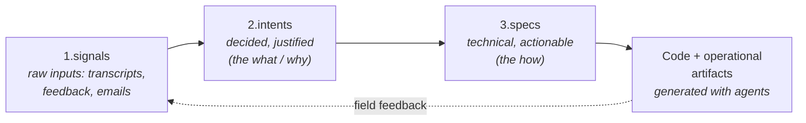
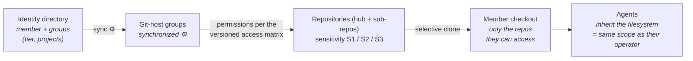
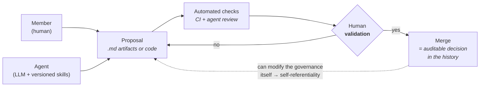
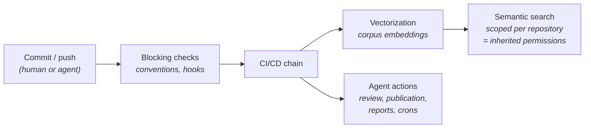

# The Concept

## The problem

Organizations are starting to delegate whole functions to AI agents — drafting proposals, closing accounting periods, publishing reports, triaging inbound requests. At that point the hard question is no longer "is the agent capable?" but:

> **How does an organization give agents access to its knowledge in a way that is safe, traceable, and governed?**

The building blocks exist in isolation: agent memory stored as Git/Markdown, runtime execution control, permission filtering bolted onto retrieval pipelines. What is missing is an assembled system where humans and agents share one organizational memory under one governance model — and where that governance is enforced by construction rather than by an extra layer that must be kept in sync.

KMS Backbone describes such a system: a knowledge management system whose repository structure *is* the governance.

## The system in brief

All organizational knowledge lives in a versioned Git monorepo as Markdown files, organized by a three-stage pipeline:

Raw material enters as **signals** (a meeting transcript, a support email). Signals are distilled into **intents** — dated, justified decisions. Intents drive **specs** — the technical "how". Specs drive code and operational artifacts, whose real-world results feed back as new signals. See [01-knowledge-layer.md](01-knowledge-layer.md) for the full grammar.

Humans and agents read and write in the same repository. Agents are defined by **skills** — capabilities written as Markdown files, versioned and reviewed like everything else (e.g. generate a branded proposal for `acme-corp`, deploy a site, classify invoices). See [03-skills-and-agents.md](03-skills-and-agents.md).

## The four bricks

### 1. Governance by git partition

The monorepo is partitioned into sub-repositories (git submodules) by sensitivity level (S1 / S2 / S3). **The unit of access is the repository**: a member — or an agent — physically cannot read what they cannot clone. There is no separate permission layer for AI; *filesystem access = knowledge access = agent access*.

The access matrix is itself a versioned file **inside** the system it governs; changing it goes through the same validation as any other change (self-referentiality). The audit trail is the git history — no separate audit system to build or trust. Details in [02-governance.md](02-governance.md).

### 2. Identical gates for humans and agents

Every contribution — from a human outside the core team or from an agent — goes through the same loop: proposal (pull request) → automated checks → **human validation** → merge. The agent produces; the human is accountable. The agent is never the last responsible party. Each merge is a dated, attributed, auditable decision.

### 3. CI/CD of knowledge: the repository as an active system

Each commit triggers an automated chain: convention checks (naming, structure — a non-conforming commit is blocked), **vectorization** of the modified corpus (embeddings into an always-current semantic search index), and agent actions (review, publication, reports). Structural consequence: **retrieval inherits permissions by construction** — the index is computed per repository, hence within the access scope, with no filtering layer to maintain.

See [04-knowledge-cicd.md](04-knowledge-cicd.md).

### 4. Provenance via git

Against the proliferation of AI-generated artifacts, versioning provides: a single **source of truth**; a dated, attributed history of every statement ("where does this come from" — the thing AI systems lack most); reproducibility of any past state; and activity reports generated by scanning the history. The discipline this requires (conventions, regular commits) is itself enforced by the checks of brick 3.

## Where to go next

[01-knowledge-layer.md](01-knowledge-layer.md) covers the repository grammar and pipeline in detail; [02-governance.md](02-governance.md) the partition, tiers, and access matrix; [03-skills-and-agents.md](03-skills-and-agents.md) how agents are defined and scoped; [04-knowledge-cicd.md](04-knowledge-cicd.md) the automation chain; [05-connections.md](05-connections.md) integrations with external tools; [06-tooling-and-sandbox.md](06-tooling-and-sandbox.md) the local setup; [07-methodology.md](07-methodology.md) the delivery methodology built on top; and [conventions.md](conventions.md) the naming and structure rules that make it all checkable.
