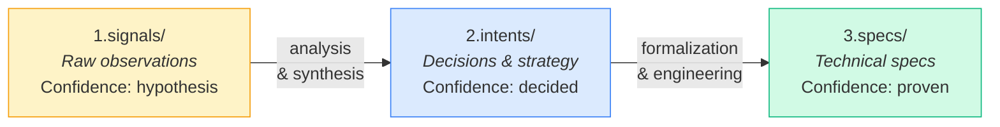
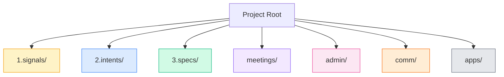
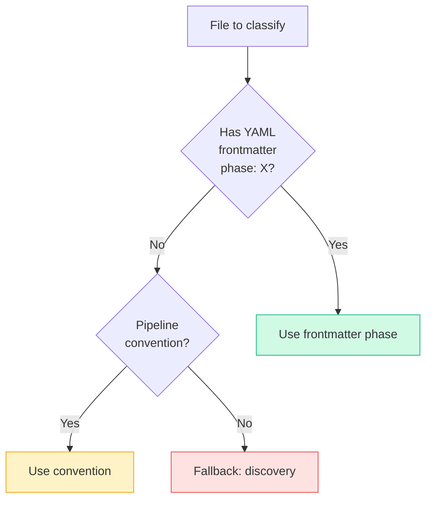
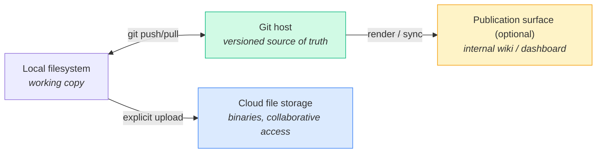

# 01 — The Knowledge Layer

> How the repository is organized, how knowledge flows through it, and where every file type belongs.

Companion docs: [00-concept.md](00-concept.md) (why this exists), [02-governance.md](02-governance.md) (access tiers, sensitivity), [07-methodology.md](07-methodology.md) (the phase model referenced below), [conventions.md](conventions.md) (naming and writing rules).

---

## 1. One repository, all knowledge

The knowledge layer is a **git repository** where everything the organization knows, decided, and produced lives as Markdown: specs, research, decisions, meeting notes, feedback, strategy.

```
KMS = the memory of the system
      everything known, decided, and produced — versioned, searchable, AI-exploitable
```

This is not a passive file store. It is the **internal model** the organization has of itself — what it knows, what it has decided, and how those decisions relate. Human contributors, coding agents, and any tooling you build (dashboards, MCP servers, indexers) all operate on this same model. See [03-skills-and-agents.md](03-skills-and-agents.md) for how agents consume it.

### Monorepo + submodules

The backbone is a **monorepo of Markdown** with **git submodules** for two things:

1. **Code** — application repositories mount under each project's `apps/` folder. Code keeps its own history, CI, and access control; the knowledge repo only pins a commit.
2. **Access boundaries** — subtrees with a different audience (e.g. an S3 finance area restricted to the core team) can be split into their own repositories and mounted as submodules. Who can clone the submodule defines who can read it. See [02-governance.md](02-governance.md).

Everything else — the actual knowledge — stays in the main repo so that search, cross-linking, and agent context work across the whole corpus.

---

## 2. Root structure

Keep the root small. A minimal working layout:

```
kms/
├── projects/           # All projects: clients, products, prospects, partnerships
│   ├── acme-travel/    #   a client project
│   └── acme-notes/     #   an internal product
├── research/           # Research programme (topics, publications, references)
├── ops/                # Company operations (finance, legal — often an S3 submodule)
├── infra/              # System docs (these files) + shared tooling
└── private/            # Local only — gitignored, never synced anywhere
```

Two structural rules:

- **Numbered prefixes encode priority** where ordering matters (`1.signals/`, `2.intents/`, `3.specs/` inside projects; optionally at root).
- **Project type is metadata, not a folder.** Clients, products, and prospects all live under `projects/` with the same grammar; a `type` field in frontmatter or a project index distinguishes them. Reorganizing by type later is a metadata change, not a mass file move.

---

## 3. The knowledge pipeline

Knowledge flows through three stages, from raw observation to technical formalization:



| Stage | Contains | Examples | Naming |
|---|---|---|---|
| **1.signals/** | Raw inputs, unprocessed | Interview transcripts, feedback emails, analytics exports, meeting recordings | Always date-first: `20260305-interview-acme.md` |
| **2.intents/** | Analyzed decisions — the "what" and "why" | Product vision, personas, market analysis, roadmap, business model | Date-first, number-first, or name-only depending on content |
| **3.specs/** | Technical formalization — the "how" | Architecture, ADRs, user flows, stories, test strategy | Generally name-only, organized by topic |

Each transition is a deliberate act (analysis, then engineering) — usually a human-reviewed agent operation. [04-knowledge-cicd.md](04-knowledge-cicd.md) covers how these promotions are run and checked.

### Decision rule: intents vs specs

- Answers "**what** should we do?" or "**why**?" → `2.intents/`
- Answers "**how** do we build it?" → `3.specs/`
- When in doubt: strategic/business → `2.intents/`, technical/engineering → `3.specs/`

This one rule resolves most filing hesitations. Business content that is neither (pitch decks, branding, go-to-market) goes to `comm/`; contractual material goes to `admin/`.

---

## 4. Project grammar

Every project follows the same directory grammar, combining the pipeline with cross-cutting dimensions:



### Single-app project

```
projects/acme-travel/
├── 1.signals/        # Raw inputs: feedback, transcripts, emails, analytics
├── 2.intents/        # Decisions: briefs, feature requests, business cases
├── 3.specs/          # Technical specs, organized by topic (never by phase)
├── apps/             # Code repositories (git submodules)
├── meetings/         # Meeting notes (date-prefixed)
├── admin/            # Contracts, proposals, quotes, legal
└── comm/             # Communication: launch plans, messaging, GTM
```

| Directory | Role | Required? |
|---|---|---|
| `1.signals/` | Raw inputs to process and classify | Yes for active projects |
| `2.intents/` | Formalized decisions and strategy | Yes for active projects |
| `3.specs/` | Technical specifications, by topic | Yes for projects with engineering |
| `meetings/` | Meeting notes, agendas, workshops | Cross-cutting, always date-prefixed |
| `admin/` | Contracts, proposals, quotes, invoices | Required for client projects |
| `comm/` | Launch plans, branding, go-to-market | When the project communicates externally |
| `apps/` | Source code (git submodules) | When the project has code |

The payoff of a fixed grammar: a human or an agent landing in any project already knows where everything is — and automation (indexers, gate checks, pipeline skills) can be written once and applied everywhere.

### Programmes and sub-projects

A **programme** is a project containing multiple sub-projects. Each sub-project is identified by a **topic** — a subfolder within the parent's pipeline directories, not a nested project tree:

```
projects/acme-suite/          # programme
├── 1.signals/                # shared signals at programme level
│   ├── copilot/              #   topic-scoped signals
│   └── member-space/
├── 2.intents/                # shared intents at programme level
├── 3.specs/
│   ├── copilot/              # sub-project "copilot"
│   └── member-space/         # sub-project "member-space"
├── meetings/                 # cross-cutting
├── admin/                    # cross-cutting
└── apps/                     # code repositories
```

**Key rule**: cross-cutting dimensions (`meetings/`, `admin/`, `comm/`) live once at the programme root. Specs are scoped by topic. Signals can be shared or topic-scoped. Each sub-project carries its own methodology phase (see [07-methodology.md](07-methodology.md)) even though they share one repo location.

### Specs internal structure

Within each `3.specs/{topic}/`, use a standard two-level layout:

```
3.specs/{topic}/
├── README.md            # Navigation hub
├── overview.md          # Main technical spec (system overview)
├── glossary.md          # Domain terminology
├── decisions.md         # Chronological decision log
│
├── architecture/        # Cross-cutting technical decisions, ADRs, diagrams
├── database/            # Data model
└── features/            # Functional specs grouped by domain
    ├── {feature-a}/
    └── {feature-b}/
```

**Root level** = meta documents — understand the project in four files. **Subdirectories** = specs by concern. Performance analyses, dev logs, and applied fixes belong in the **app repository** (`apps/*/docs/`), not in the knowledge repo: specs hold the what/why of the design, app docs hold the operational how. Never duplicate between the two levels; link instead.

---

## 5. Phase as metadata

Methodology phases (discovery, define, deliver, deploy, …) are **not directories**. They are **metadata** on documents. This is the single most structural choice in the system: a document's location encodes what it *is* (signal, intent, spec), not where the project currently *stands*. Phases move; files don't.

### Detection priority



| Priority | Mechanism | Example |
|---|---|---|
| 1 (highest) | YAML frontmatter | `phase: define` in the file header |
| 2 (fallback) | Pipeline directory convention | `1.signals/` → discovery, `2.intents/` → define, `3.specs/` → deliver |

### Convention mapping

| Directory | Default phase | Rationale |
|---|---|---|
| `1.signals/` | discovery | Signals are raw discovery inputs |
| `2.intents/` | define | Intents formalize decisions |
| `3.specs/` | deliver | Specs drive implementation |
| `apps/` | deliver | Code is a deliver-phase output |
| `comm/` | communicate | Communication content |

Frontmatter is optional — use it only when the default convention doesn't fit (e.g. an intent that actually belongs to discovery):

```yaml
---
phase: define
status: draft
---
```

---

## 6. Storage routing

Not everything belongs in git. The layer uses distinct channels, each with a clear role:



| Type | Git | Cloud storage |
|---|---|---|
| `.md` files | Yes (source of truth) | Optional mirror |
| Small `.csv` (< 1 MB) | Yes | Optional |
| Binaries (PDF, images, media, large CSV) | No — gitignored | Yes |
| Code | Yes — as submodules | No |
| `private/` | No | No — strictly local |

Rules worth stating explicitly:

- **Markdown → git.** Git is the only source of truth for knowledge. Any cloud mirror or wiki render is a derived view.
- **Binaries → cloud storage, with a manifest.** Each folder holding binaries keeps a small Markdown manifest (e.g. `_files.md`) listing what lives in cloud storage (GitHub/GitLab won't hold your media; Google Drive/Dropbox/S3-compatible storage will). The manifest is versioned in git, so the *existence and description* of every binary is part of the knowledge graph even though the bytes are not.
- **Uploads are explicit, not daemon-driven.** Push binaries to cloud storage as a deliberate, one-shot action (API call or manual upload). Avoid background filesystem-watcher sync on a git working copy: a branch checkout can look like a mass deletion to a live watcher and propagate destructively. If you do run a live sync daemon, never switch branches while it runs — and prefer merging via pull request on your git host over local merges.
- **Code → git submodules.** Application repos are pinned, not vendored. The knowledge repo records *which* version; the app repo owns the content.
- **`private/` → local only.** Gitignored, never uploaded, never published. For scratch material and things that must not leave the machine.

Connections to external systems (issue trackers, drives, chat) are covered in [05-connections.md](05-connections.md); the local tooling that enforces the routing rules is in [06-tooling-and-sandbox.md](06-tooling-and-sandbox.md).
