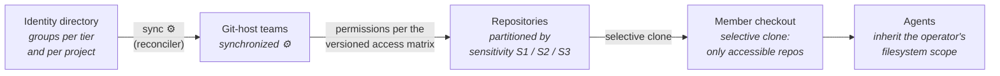
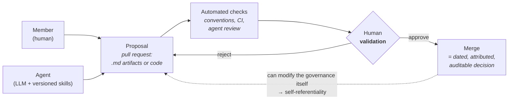

# The Governance Layer: Partition as Policy

## The principle

The unit of access is the **repository**. Instead of per-file ACLs, per-folder permissions, or a database of grants, the knowledge base is partitioned into git repositories (a hub plus submodules) by sensitivity level, and access is granted repository by repository. A member who cannot clone a repository does not have a degraded view of its content — they have **no** view. The content is simply absent from their filesystem.

This matters most for agents. An agent runs inside an operator's checkout (or a deployment runtime with its own checkout). It reads the filesystem; it cannot read what was never cloned. So one mechanism covers both populations:

> **filesystem access = knowledge access = agent access**

There is no separate IAM layer for AI. No agent-specific permission model to design, keep in sync, or audit against the human one. The partition *is* the policy — access control is enforced by construction, not by an added layer that can drift.

Three sensitivity levels drive the partition (see [01-knowledge-layer.md](01-knowledge-layer.md) for what typically lands in each):

| Level | Scope | Typical content |
|---|---|---|
| **S1** | Open to all members | Guides, conventions, handbook, shared infrastructure docs |
| **S2** | Extended circle, per assignment | Project repositories — visible only to members assigned to that project |
| **S3** | Core team only | Strategy, finance, HR/member records, pre-sale pipeline, the governance folder itself |

## The identity chain

Access flows through a single chain with one source of truth at its head:

1. **Identity directory** (e.g. Google Workspace groups, or any identity provider that models groups): one group per tier (`core-team`, `extended-circle`) and one per project (`prj-<slug>`). Membership in groups — never individual grants — is the only input.
2. **Git-host teams**: a reconciler synchronizes directory groups to teams on your git host (GitHub/GitLab organizations both support this pattern) and applies the repository permissions declared in the access matrix.
3. **Repositories**: the hub repo references submodules; each submodule carries one sensitivity level. Cloning the hub materializes only the submodules the member's teams can reach.
4. **Member checkout**: the working tree contains exactly the accessible repositories — nothing to hide, nothing to filter.
5. **Agents**: any agent launched in that checkout operates within the same perimeter. Deployed agents (crons, webhooks) run on a runtime whose checkout is scoped the same way, via a service identity that is itself a group member.

A **drift audit** periodically compares the real state (git-host teams and permissions) against the declared matrix and flags divergence. The reconciler enforces; the audit verifies.

## The access matrix: policy as a versioned artifact

The policy itself is a markdown file — see the template at [template/governance/access-matrix.md](../template/governance/access-matrix.md) — mapping groups × repositories × sensitivity × rights (clone / write / admin). Two properties follow from it living *inside* the governed system:

- **Self-referentiality**: changing who can access what is a pull request on the matrix file, going through the same gates as any other artifact. The system that enforces the policy also governs changes to the policy. There is no out-of-band admin console where access quietly changes.
- **Audit trail for free**: `git log` on the matrix file is the complete, dated, attributed history of every access decision. Combined with drift-audit reports, this answers "who could read what, when, and who decided" without a dedicated audit system.

## Gates: one validation loop for humans and agents

Every contribution — whether from a human outside the core team or from an agent — enters through the same loop:

The rules, in RACI terms:

- The agent is at most **Responsible** (it produces the proposal). A human is always **Accountable** (they approve the merge). The agent is never the last responsible party — no agent-approved, agent-merged change exists in the system.
- Automated checks (naming conventions, structure, CI, optionally an agent pre-review) run before human attention is spent — see [04-knowledge-cicd.md](04-knowledge-cicd.md).
- Who may validate depends on the sensitivity of the target repository; defaults are in the [gates template](../template/governance/gates.md).
- Every merge is a decision: dated, attributed to an approver, recoverable from the history. Activity and compliance reports are generated by scanning it.

Gate philosophy: gates add a small upstream cost and intercept drift before it compounds. An unnoticed stale access grant is the organizational equivalent of a defect reaching production. The methodology layer ([07-methodology.md](07-methodology.md)) reuses the same gate pattern for project phases.

## Practical notes

**Submodule topology follows sensitivity, not org charts.** The rule of thumb: split a repository when the ACL differs, not when the topic differs. A hub repo (S1) references S2 project submodules and S3 core-only submodules. Two folders with identical audiences belong in one repository; a folder whose audience narrows gets extracted into its own submodule and re-referenced from the hub. Topic separation is handled by folders and communication channels, not by repository boundaries.

**Onboarding is a group membership change.** Admitting a member = adding them to their tier group and project groups. The reconciler propagates to git-host teams; the member clones the hub and gets exactly their perimeter. **Offboarding is the same gesture in reverse**: removing the groups revokes every repository at once — one action, propagated automatically, no checklist of systems to remember. Emergency revocation is therefore also a single action.

**Exceptions are groups too.** A temporary opening of an S3 repository to a specific person is implemented as a dedicated group (e.g. `s3-exception-<topic>`), recorded as a dated decision, and re-justified or closed at each periodic audit — never as an individual grant on the git host.
