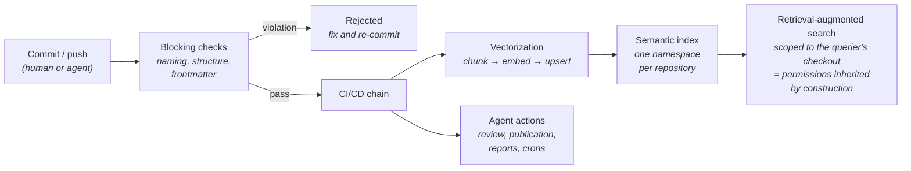

# CI/CD of Knowledge — The Repository as an Active System

In most knowledge bases, writing a document is the end of the story. Here it is the beginning: every commit to the knowledge repository triggers an automated chain, exactly as a commit to a codebase triggers build, test, and deploy. The repository is not a passive archive — it is the input to a pipeline that keeps conventions enforced, the semantic index current, and agents working.

## What a commit triggers

Three families of actions, in order:

1. **Blocking convention checks.** Naming (date-first files in `1.signals/` and `meetings/`), structure (no phase directories inside `3.specs/`), frontmatter validity, forbidden patterns (time estimates instead of S/M/L sizing). A non-conforming commit is rejected before it lands — see [conventions.md](conventions.md) for the full rule set.
2. **Vectorization of the modified corpus.** Changed Markdown files are chunked, embedded, and upserted into a semantic search index. The index is always at most one push behind the repository.
3. **Agent actions.** Non-blocking automation: an agent review of the diff, publication of approved content to an external surface, activity reports scanned from the history, scheduled crons (digests, syncs — see [05-connections.md](05-connections.md)).

## The key structural property: permission inheritance by construction

Retrieval-augmented generation over organizational knowledge has an access-control problem: a shared vector index does not know who is asking. The common answers are post-hoc filtering (attach ACL metadata to every chunk, filter at query time) or an LLM-based gatekeeper — both are extra layers that must be kept in sync with the real permission system, and both fail open or fail probabilistically.

This system dissolves the problem instead of solving it. [02-governance.md](02-governance.md) establishes that the unit of access is the repository: the monorepo is partitioned into sub-repositories (git submodules) by sensitivity, and a member or agent physically cannot read what they cannot clone. The indexing pipeline follows the same partition:

- **The index is computed per repository.** Each sub-repository's CI vectorizes only its own content, into its own namespace (a distinct collection, schema, or `repo` key in the vector store). Content from two repositories never shares a namespace.
- **Query-side scoping is a list lookup, not a filter.** An agent's retrieval tool queries exactly the namespaces corresponding to the repositories present in its operator's checkout. That list is derived from the filesystem the agent already runs on — the same fact that governs its file access.

Concretely: an agent operating for a member with access to the hub plus sub-repos `A` and `C` queries namespaces `{hub, A, C}`. Sub-repo `B`'s content is not filtered out of the results — it was never in any index the agent can address. There is no ACL table to synchronize, no per-chunk metadata to trust, no probabilistic guarantee to audit. If the git host denies the clone, the index is unreachable, by construction.

The cost of this design is honest to state: scoping granularity is the repository. If a finer partition is needed, the answer is to split the repository — which also fixes file-level access, keeping the two systems identical rather than merely consistent.

## Local layer and remote layer

The chain runs at two points, with different latency and authority:

| | Local (hooks) | Remote (CI pipeline) |
|---|---|---|
| **Where** | Git hooks and agent-CLI hooks on the contributor's machine | CI runner on the git host |
| **When** | On file write / on commit — immediate | On push / on merged PR |
| **What** | Convention checks only (fast, no secrets) | Convention checks (authoritative re-run) + vectorization + agent actions |
| **Why both** | Sub-second feedback; an agent writing a misnamed file is corrected in the same session, before the file ever reaches a commit | Local hooks can be bypassed or missing; CI is the enforcement point of record, and the only layer holding embedding/database credentials |

The local layer matters more here than in classic software CI because half the contributors are agents. A hook wired into the agent CLI (fired after every file write) turns each convention violation into an immediate corrective signal in the agent's own loop — cheaper than a failed CI run minutes later. The remote layer is what makes the guarantee: nothing merges, and nothing gets indexed, without passing the checks on the runner.

## Index lifecycle

- **Incremental indexing.** On each push, the pipeline diffs against the previous head and processes only changed `.md` files. A full corpus rebuild is a manual dispatch, not the default.
- **Deletion propagation.** A file deleted from the repository has its chunks deleted from the index in the same run — otherwise removed knowledge stays retrievable forever, which silently breaks the access story. Diff-based runs handle this per file; full-scan runs prune by comparing the index's file list against the working tree.
- **Re-index on convention or pipeline change.** Chunking parameters, embedding model, and metadata extraction are versioned with the repository. Changing any of them invalidates the index's consistency; the change lands together with a triggered full rebuild.
- **Submodule lag.** A sub-repository's content can change before the parent repo's pointer is bumped. Either each sub-repo runs its own indexing pipeline (preferred — it matches the one-namespace-per-repo design), or a scheduled safety-net run re-scans submodules from the hub.

## Templates

Working starting points live in the template layer: [`template/.github/workflows/conventions.yml`](../template/.github/workflows/conventions.yml) (blocking checks) and [`template/.github/workflows/vectorize.yml`](../template/.github/workflows/vectorize.yml) (reference indexing pipeline). The pipeline contract itself is specified in [`reference/vectorization/README.md`](../reference/vectorization/README.md); agent execution around the chain is covered in [06-tooling-and-sandbox.md](06-tooling-and-sandbox.md).
