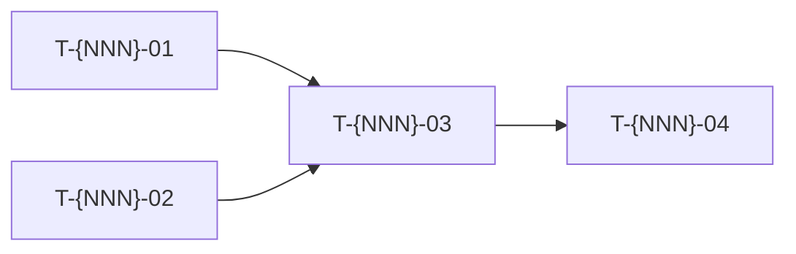

Decompose user stories into implementation tasks.

This bridges Define → Deliver: it takes accepted stories and produces a task breakdown ready for execution briefs and multi-agent assignment.

Reference: the KMS Backbone docs (docs/ in the backbone repo) — Deliver toolkit, Task decomposition.

The user will provide:
1. Project path (e.g., `projects/acme-app/`)
2. Story or stories to decompose (ID, file path, or "all")

Steps:
1. Read the target story/stories (acceptance criteria, priority, effort)
2. Read `{project}/3.specs/architecture.md` for patterns and constraints
3. Read `{project}/3.specs/glossary.md` for domain terms
4. Read existing ADRs in `{project}/3.specs/adr/` for technical decisions
5. If code exists in `apps/`, inspect the relevant codebase structure
6. Decompose each story into tasks

Task granularity checklist (each task must satisfy ALL):
- [ ] Can be completed in < 1 day of focused work?
- [ ] Has a clear Definition of Done?
- [ ] Results in a single reviewable PR?
- [ ] Tests can verify completion?
- [ ] No ambiguous scope?

Scope guide: **1 user story = 3-8 tasks**. If more, the story is too large — flag it.

Output format:

```markdown
# Task Decomposition — {project name}

## US-{NNN}: {Story title}

### Tasks

| ID | Title | Effort | Depends on | Exclusive scope | DoD |
|---|---|---|---|---|---|
| T-{NNN}-01 | {action verb + object} | S/M/L | — | {file/folder} | {what "done" looks like} |
| T-{NNN}-02 | ... | S | T-{NNN}-01 | ... | ... |

### Dependency graph



### Traceability
- Story: US-{NNN}
- Acceptance criteria covered: {list which AC each task contributes to}
- Architecture patterns: {relevant ADRs}

### Open questions
- {any ambiguity or missing info that blocks task definition}
```

Task naming convention:
- ID: `T-{story-number}-{sequential}` (e.g., T-003-01, T-003-02)
- Title: always starts with an action verb (Create, Implement, Add, Configure, Test, Refactor)

Rules:
- Every task must trace to at least one acceptance criterion
- Every acceptance criterion must be covered by at least one task
- Flag orphan tasks (no AC link) and uncovered ACs
- Exclusive scope ensures no merge conflicts in multi-agent work
- Effort sizing: S / M / L only — never time estimates
- Do NOT create files automatically — present decomposition and wait for user validation
- After validation, the user can run `/execution-brief` on individual tasks
- Write N/C for information not available — never invent technical details
